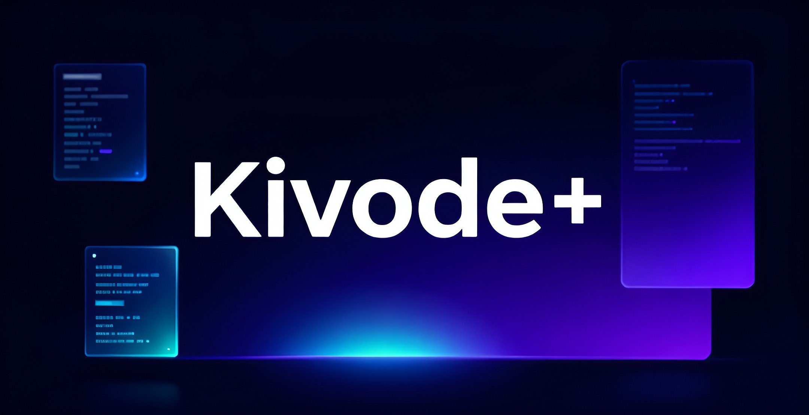

<div align="center">

# Kivode+ Desktop

**Secure AI-assisted desktop code workspace built with Electron + React + TypeScript**

<p align="center">
  
</p>

<p>
  <a href="#quick-start"></a>
  <a href="#build-and-package"></a>
  <a href="#python-runtime-bundled-offline"></a>
  <a href="#security"></a>
</p>

<p>
  
  
  
  
  
</p>

</div>

---

## Table of Contents

- [What is Kivode+ Desktop?](#what-is-kivode-desktop)
- [Contribution Model](#contribution-model)
- [Community Ecosystem](#community-ecosystem)
- [Community Builds](#community-builds)
- [Core Features](#core-features)
- [Architecture at a Glance](#architecture-at-a-glance)
- [Prerequisites](#prerequisites)
- [Quick Start](#quick-start)
- [Complete Setup (Step by Step)](#complete-setup-step-by-step)
- [Python Runtime (Bundled Offline)](#python-runtime-bundled-offline)
- [Run in Development](#run-in-development)
- [Build and Package](#build-and-package)
- [Verification and Security Gates](#verification-and-security-gates)
- [Troubleshooting](#troubleshooting)
- [Project Structure](#project-structure)
- [Contributing](#contributing)
- [Community and Credits](#community-and-credits)
- [License](#license)

## What is Kivode+ Desktop?

Kivode+ Desktop is a desktop engineering environment focused on secure AI workflows.

It combines:

- a hardened Electron main process,
- a modern React renderer,
- policy-controlled filesystem and process execution,
- an offline-capable bundled Python runtime for sandboxed operations,
- repository and project analysis features.

## Contribution Model

This repository is the **Reference Implementation** of Kivode+.

The governance model is intentionally designed for an ecosystem of **Independent Fork** projects:

- Community developers are encouraged to fork this repository and build their own versions.
- Developers may modify, rename, and publish their versions in their own GitHub repositories.
- Each derivative project is owned, maintained, and supported by its own developer team.
- The official Kivode+ repository does **not** merge external feature forks directly into the Reference Implementation.

In this model, community innovation happens in independent repositories, while the Reference Implementation remains the official baseline.

## Community Ecosystem

Kivode+ supports a public ecosystem where developers can submit their projects for a potential **Directory Listing** on the official platform.

Developer Submissions are reviewed through:

https://kivode.com/apps/submit

Approved listings may include:

- project name,
- screenshots,
- project description,
- repository link,
- developer profile,
- social media links.

For submission and review details, see:

- [`docs/community/directory-model.md`](./docs/community/directory-model.md)
- [`docs/community/submission-process.md`](./docs/community/submission-process.md)
- [`docs/dev/submissions/guidelines.md`](./docs/dev/submissions/guidelines.md)
- [`docs/dev/submissions/review-criteria.md`](./docs/dev/submissions/review-criteria.md)

## Community Builds

The official website maintains a curated directory of **Community Builds**.

| Project       | Developer | Repository     | Description         |
| ------------- | --------- | -------------- | ------------------- |
| Example Build | devname   | github.com/... | Improved UI version |

---

## Core Features

| Area | Capability | Notes |
|---|---|---|
| Code Editing | Multi-file editor, tabs, formatting support | Built with CodeMirror + Prettier workflow |
| AI Assistance | Multi-provider orchestration | Provider/model controls exposed in settings |
| Security | IPC boundaries, command policy, FS allowlist, redaction | Security-critical logic stays in `src/main/security` |
| Sandbox | Controlled Python task execution | Uses bundled runtime + offline wheels |
| GitHub Workflows | Repository clone, README and analytics support | Routed through trusted main-process services |
| Release Packaging | Windows/macOS/Linux targets | Scripts available in `package.json` |

---

## Architecture at a Glance

For the full architecture document, read [`ARCHITECTURE_OVERVIEW.md`](./ARCHITECTURE_OVERVIEW.md).

```text
src/
  main/
    security/
    services/
    python/
  renderer/
    src/
      components/
      stores/
      utils/
resources/python/
  bootstrap/
  runtime/<platform-arch>/
  wheels/<platform-arch>/
scripts/
```

See [ARCHITECTURE_OVERVIEW.md](./ARCHITECTURE_OVERVIEW.md) for deeper details.

## Prerequisites

### Required

- Node.js **20+**
- npm **10+**
- Git **2.40+**

### Optional but recommended

- Python **3.11+** locally (for development tooling only)
- Build toolchain for your OS (see platform-specific section)

> In packaged production builds, Python tasks must run using the bundled runtime from `resources/python/runtime/<platform-arch>` and not system Python.

---

## Quick Start

```bash
git clone https://github.com/aymantaha-dev/kivode-plus.git
cd kivode-plus.src
npm install
npm run dev
```

---

## Complete Setup (Step by Step)

### 1) Clone repository

```bash
git clone https://github.com/aymantaha-dev/kivode-plus.git
cd kivode-plus.src
```


### 2) Install Node dependencies

```bash
npm install
```

### 3) (Optional) Setup local Python virtual environment for local checks

```bash
python -m venv .venv
# Linux/macOS:
source .venv/bin/activate
# Windows PowerShell:
# .\.venv\Scripts\Activate.ps1

pip install -r resources/python/requirements.txt
```

### 4) Verify baseline security and build checks

```bash
npm run security:check
npm run verify:baseline
```

### 5) Validate bundled Python assets for current platform

```bash
npm run verify:sandbox-assets
```

---

## Python Runtime (Bundled Offline)

Kivode+ uses a bundled Python strategy for packaged applications.

### Runtime directories

Each platform requires:

- `resources/python/runtime/<platform-arch>/...` (Python executable)
- `resources/python/wheels/<platform-arch>/...` (all required wheel files)

Supported platform keys:

- `win32-x64`, `win32-arm64`
- `darwin-x64`, `darwin-arm64`
- `linux-x64`, `linux-arm64`

### Expected executable paths

- **Windows**: `resources/python/runtime/<platform-arch>/python.exe`
- **Linux/macOS**: `resources/python/runtime/<platform-arch>/bin/python3`

### Required wheels

Wheels must satisfy `resources/python/requirements.txt` for each platform target:

- PyYAML
- beautifulsoup4
- toml
- jedi
- radon
- pygments

### Why runtime can appear "Unavailable"

If UI shows Python unavailable after packaging, usually one of these is missing:

1. Bundled executable is not under `resources/python/runtime/<platform-arch>`.
2. Offline wheels are missing under `resources/python/wheels/<platform-arch>`.
3. `assistant_env.py` was not packaged to `resources/python/assistant_env.py`.
4. Built app architecture does not match bundled runtime architecture.

### Important behavior

- In packaged mode, Python execution is restricted to **bundled runtime only**.
- System-installed Python fallback is intentionally disabled for packaged builds.

---

## Run in Development

### Full app (recommended)

```bash
npm run dev
```

### Run renderer only

```bash
npm run dev:renderer
```

### Run main process only

```bash
npm run dev:main
```

---

## Build and Package

### Standard production build

```bash
npm run build
```

### Windows package

```bash
npm run build:windows
```

### macOS package

```bash
npm run build:mac
```

### Linux package

```bash
npm run build:linux
```

### All targets (host/toolchain dependent)

```bash
npm run build:all
```

---

## Verification and Security Gates

Run all critical checks before release:

```bash
npm run test
npm run security:check
npm run verify:baseline
npm run verify:sandbox-assets
```

Optional platform-targeted asset verification:

```bash
npm run verify:sandbox-assets:win32-x64
```

---

## Platform Notes

### Windows

- Use PowerShell or Git Bash.
- Ensure Visual Studio Build Tools are available for native dependencies.
- Validate bundled runtime path: `resources/python/runtime/win32-x64/python.exe` (or arm64 key).

### macOS

- Install Xcode Command Line Tools.
- Validate bundled runtime path: `resources/python/runtime/darwin-*/bin/python3`.

### Linux

- Install common build tools (`build-essential`, Python dev headers as needed).
- Validate bundled runtime path: `resources/python/runtime/linux-*/bin/python3`.

---

## Troubleshooting

### Python badge shows unavailable in app

1. Run:
   ```bash
   npm run verify:sandbox-assets
   ```
2. Confirm packaged runtime executable path exists for your target platform.
3. Confirm wheels directory contains all required `.whl` files.
4. Rebuild and relaunch app after assets are corrected.

### Build succeeds but packaged app cannot run Python tasks

- Verify `extraResources` packaging includes both:
  - `src/main/python/**/*.py`
  - `resources/python/**/*`
- Ensure platform/arch runtime and wheels match packaged target.

### Security checks fail

- Run:
  ```bash
  npm run security:check
  npm run verify:baseline
  ```
- Apply fixes without weakening allowlists/sandbox boundaries.

Please read [CONTRIBUTING.md](./CONTRIBUTING.md) before opening pull requests.

## Project Structure

```text
.
├── assets/
├── docs/
│   ├── community/
│   └── dev/submissions/
├── resources/
│   └── python/
├── scripts/
├── src/
│   ├── main/
│   │   ├── python/
│   │   ├── security/
│   │   └── services/
│   └── renderer/
├── ARCHITECTURE_OVERVIEW.md
├── CHANGELOG.md
├── CONTRIBUTING.md
├── SECURITY.md
└── README.md
```

- Security reporting: [SECURITY.md](./SECURITY.md)
- Changelog: [CHANGELOG.md](./CHANGELOG.md)

## Contributing

Please read:

- [`CONTRIBUTING.md`](./CONTRIBUTING.md)
- [`SECURITY.md`](./SECURITY.md)
- [`CHANGELOG.md`](./CHANGELOG.md)

---

## Community and Credits

Developed by **aymantaha-dev@**

- GitHub: `https://github.com/aymantaha-dev`
- Instagram: `https://instagram.com/aymantaha.dev`
- Discord: `https://discord.gg/rUdaR8PG`

---

## License

Licensed under the **Kivode Community Non-Commercial License 1.0**.
See [`LICENSE`](./LICENSE).
